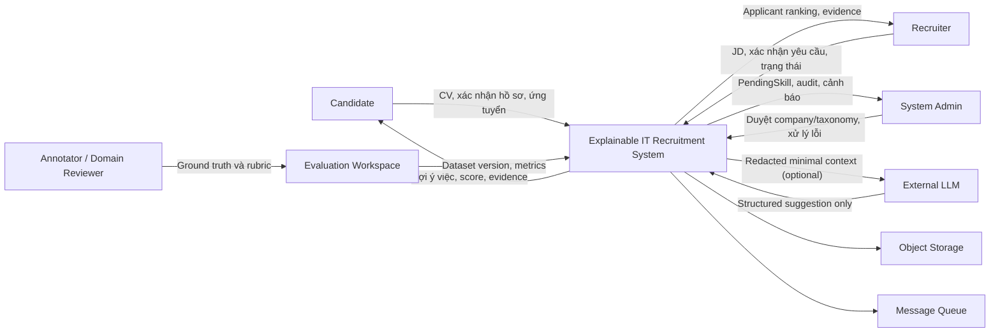

# Stakeholder, Actor và System Context

| Thuộc tính | Giá trị |
|---|---|
| Mã tài liệu | DOC-CTX-001 |
| Phiên bản | 0.2.0 |
| Trạng thái | Working baseline |

## 1. Stakeholder analysis

| Mã | Stakeholder | Mục tiêu | Pain point | Mối quan tâm/tiêu chí chấp nhận |
|---|---|---|---|---|
| ACT-CAN | Candidate | Duyệt việc, ứng tuyển, hiểu khoảng thiếu của Application | JD dài, alias công nghệ, điểm black-box | Dữ liệu parse sửa được; explanation sau apply; quyền riêng tư |
| ACT-REC | Recruiter | Tạo JD, sàng lọc có căn cứ, theo dõi application | Nhiều CV, keyword miss, đánh giá thiếu nhất quán | Ranking truy vết được; không che CV; kiểm soát trạng thái |
| ACT-ADM | System Admin | Vận hành, kiểm soát user/company/taxonomy | Thuật ngữ mới, task lỗi, rủi ro dữ liệu | Audit/version; hàng chờ review; không duyệt mù |
| ACT-AIW | AI Worker | Thực thi pipeline nhất quán | Tài liệu đa dạng, timeout, model drift | Contract rõ; idempotent; có fallback/version |
| ACT-ANN | Data Annotator/Domain Reviewer | Tạo ground truth đáng tin | Tiêu chí mơ hồ, bất đồng | Guideline, blind annotation, adjudication |
| STK-GVH | GVHD/Hội đồng | Đánh giá tính khoa học và khả thi | Scope rộng, thiếu baseline/metric | RQ rõ; kết quả tái lập; limitation trung thực |
| STK-OWN | Tác giả đồ án | Hoàn thành sản phẩm và nghiên cứu | Solo, thời gian/tài nguyên hạn chế | Research-first backlog; cut-line rõ |

## 2. Phân loại actor

- **Actor nghiệp vụ chính**: Candidate, Recruiter, System Admin.
- **Actor kỹ thuật**: AI Worker, scheduler/queue consumer.
- **Stakeholder nghiên cứu**: Annotator/Domain Reviewer, GVHD/Hội đồng.
- Annotator không phải tài khoản sản phẩm bắt buộc; annotation có thể thực hiện bằng bộ công cụ nghiên cứu riêng.
- Recruiter quản lý công ty cơ bản trong MVP; Company Admin riêng là extension.

## 3. System context

## 4. Ranh giới hệ thống

### Bên trong

- Identity/RBAC.
- Company, Job/JD, CV/Profile, Application.
- Parsing, normalization, matching, explanation.
- Taxonomy workflow và audit.
- Dataset/experiment metadata cần cho nghiên cứu.
- Queue processing, retry và observability tối thiểu.

### Bên ngoài

- External LLM (tùy chọn, không đáng tin mặc định).
- Email/notification provider (extension).
- Cloud object storage (adapter; local/MinIO ở demo).
- Nguồn CV/JD và người gán nhãn.
- Hệ thống HRM/interview/payment/crawling.

## 5. Ma trận quyền mức cao

Ký hiệu: `O` = dữ liệu của mình, `C` = trong công ty, `A` = toàn hệ thống theo nhiệm vụ, `–` = không có quyền.

| Tài nguyên/Hành động | Candidate | Recruiter | Admin | AI Worker |
|---|---:|---:|---:|---:|
| Xem/sửa Candidate Profile | O | Chỉ snapshot được phép | A có lý do/audit | Tối thiểu cần xử lý |
| Upload/xác nhận CV | O | – | Hỗ trợ có audit | Parse theo task |
| Xem CV gốc | O | C khi Candidate đã apply/consent | Có lý do/audit | Tạm thời theo task |
| Tạo/sửa JD | – | C | A khi hỗ trợ | Parse theo task |
| Publish/close Job | – | C | Khóa/gỡ khi vi phạm | – |
| Duyệt Job Published/xem kết quả Application của mình | O | – | Chẩn đoán có audit | Tính matching sau apply |
| Xem applicant ranking | – | C theo Job | Chẩn đoán có audit | Tính toán |
| Apply/withdraw | O | – | – | – |
| Cập nhật application status | – | C theo Job | Can thiệp có audit | – |
| Quản lý taxonomy | Đề xuất gián tiếp | Đề xuất gián tiếp | A | Phát hiện/gợi ý |
| Approve PendingSkill | – | – | A | – |
| Xem dataset nghiên cứu | Chỉ dữ liệu của mình nếu có | Chỉ khi được phân công | Theo quyền | Chỉ bản ẩn danh |

## 6. Nguyên tắc quyền riêng tư

1. Candidate sở hữu CV gốc và có quyền biết mục đích xử lý.
2. Recruiter chỉ xem CV khi có quan hệ ứng tuyển hoặc cơ chế consent được chốt.
3. Ranking không dùng name, photo, gender, age, birth date, address, marital status, ethnicity, religion, email/phone.
4. Admin access dữ liệu nhạy cảm phải có mục đích, audit và giới hạn thời gian.
5. AI Worker nhận object reference/token ngắn hạn, không phát tán raw CV qua event.
6. External LLM chỉ nhận redacted minimal context; prompt/response phải được kiểm soát retention.

## 7. Nhu cầu theo actor

### Candidate

- Biết parse đang ở trạng thái nào và lỗi gì có thể tự sửa.
- Phân biệt “không tìm thấy bằng chứng” với “không có kỹ năng”.
- Xem từng thành phần điểm, không chỉ phần trăm tổng.
- Không bị auto-reject bởi hệ thống.

### Recruiter

- Xác nhận required/preferred thay vì để parser tự suy đoán hoàn toàn.
- Biết score/version nào đang hiển thị và dữ liệu có low confidence không.
- Có filter nghiệp vụ nhưng ranking phải giữ evidence.
- Quyết định trạng thái application độc lập với score.

### Admin

- Có hàng chờ PendingSkill ưu tiên theo tần suất/rủi ro.
- So sánh candidate với taxonomy hiện tại để tránh duplicate.
- Merge phải giữ alias và lịch sử.
- Có thể reprocess theo batch, rollback taxonomy version nếu cần.

### Annotator/Reviewer

- Không nhìn score của hệ thống khi gán nhãn.
- Có guideline, ví dụ biên và lựa chọn “không đủ thông tin”.
- Có cơ chế adjudication và đo agreement.

## 8. Xung đột nghiệp vụ cần kiểm soát

| Xung đột | Cách xử lý baseline |
|---|---|
| Candidate muốn riêng tư, Recruiter muốn tìm toàn kho | MVP ưu tiên applicant ranking; sourcing toàn kho cần consent riêng |
| Recruiter coi required là hard constraint, Candidate vẫn có transferable skill | Hiển thị penalty và missing requirement; không auto-reject |
| Admin muốn taxonomy nhanh, nghiên cứu cần độ đúng | Pending/approve + audit; acceptance rate không thay ground truth |
| Hệ thống muốn re-score khi model đổi, audit cần giữ kết quả cũ | Immutable MatchingResult theo version; tạo bản mới |
| LLM giúp hiểu thuật ngữ, privacy hạn chế gửi CV | Chỉ gửi redacted snippet tối thiểu hoặc dùng fallback local |
