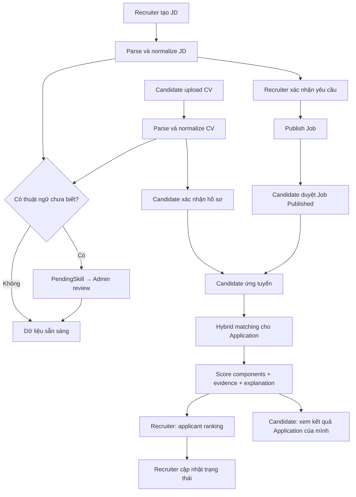
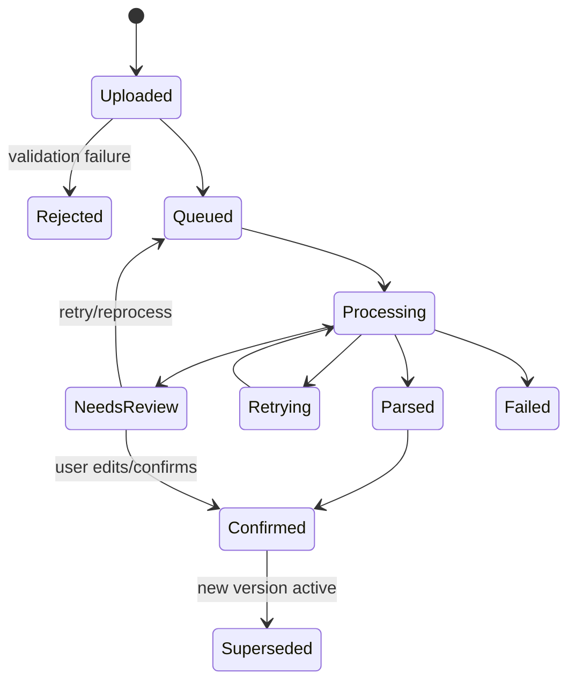
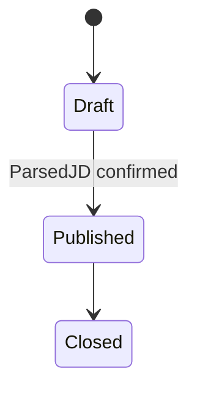
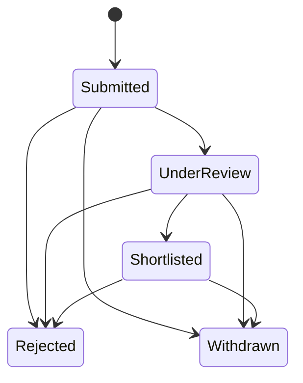
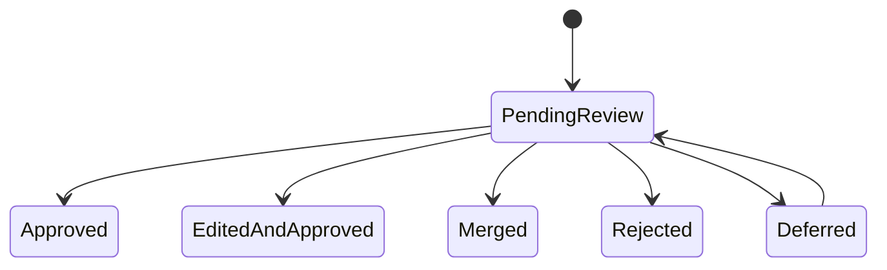

# Business Processes

| Thuộc tính | Giá trị |
|---|---|
| Mã tài liệu | DOC-BP-001 |
| Phiên bản | 0.2.0 |
| Trạng thái | Working baseline |

## 1. Bản đồ quy trình

| Mã | Quy trình | Actor chính | Kết quả |
|---|---|---|---|
| BP-01 | Tạo, phân tích và publish JD | Recruiter, AI Worker | Job có ParsedJD được xác nhận |
| BP-02 | Upload, phân tích và xác nhận CV | Candidate, AI Worker | CVVersion có ParsedCV được xác nhận |
| BP-03 | Phát hiện và duyệt thuật ngữ mới | AI Worker, Admin | Taxonomy version mới hoặc proposal bị xử lý |
| BP-04 | Tính matching và explanation | AI Worker | MatchingResult bất biến, có component/evidence/version |
| BP-05 | Candidate duyệt việc và ứng tuyển | Candidate | Application hợp lệ; matching task được tạo sau apply |
| BP-06 | Recruiter sàng lọc và cập nhật đơn | Recruiter | Applicant ranking và status history |
| BP-07 | Retry, review và phục hồi tác vụ lỗi | AI Worker, Admin | Task hoàn tất, NeedsReview hoặc DeadLetter |

## 2. Luồng end-to-end

## 3. BP-01 — Tạo, phân tích và publish JD

| Thuộc tính | Nội dung |
|---|---|
| Mục tiêu | Chuyển JD do Recruiter cung cấp thành yêu cầu có cấu trúc và được con người xác nhận |
| Actor | Recruiter (chính), AI Worker, Admin (khi có PendingSkill) |
| Tiền điều kiện | Recruiter active và thuộc Company active |
| Trigger | Recruiter tạo Job draft hoặc tải/dán JD |
| Đầu vào | Title, raw JD text, thông tin công ty, optional structured fields |
| Đầu ra | JobVersion, ParsedJD, evidence, confidence, PendingSkill nếu có |
| Hậu điều kiện | Chỉ JobVersion có ParsedJD Confirmed mới được publish |
| Rule chính | BR-002, BR-008 đến BR-015 |

### Luồng chính

1. Recruiter tạo Job ở trạng thái `Draft` và nhập title/raw JD.
2. Core lưu JobVersion bất biến và tạo ProcessingTask với idempotency key.
3. AI Worker trích xuất title, seniority, responsibilities, required/preferred skills, experience, education và language requirements.
4. Normalizer đối chiếu exact name → alias → fuzzy/semantic candidates.
5. Thuật ngữ chưa xác định tạo PendingSkill, nhưng không chặn Recruiter xem bản parse.
6. Hệ thống trả ParsedJD kèm confidence/evidence trên từng field.
7. Recruiter sửa, thêm, xóa và phân loại required/preferred; mọi sửa đổi có audit.
8. Recruiter xác nhận ParsedJD.
9. Hệ thống kiểm tra điều kiện publish và chuyển Job sang `Published`.
10. Phát event `job.published.v1` để lập chỉ mục/tính matching bất đồng bộ.

### Luồng thay thế

- Recruiter nhập form có cấu trúc: parser dùng dữ liệu form làm ưu tiên, raw JD vẫn giữ để evidence.
- Recruiter lưu draft khi chưa xác nhận: Job không xuất hiện trong danh sách Published và không nhận Application.
- PendingSkill chưa duyệt: giữ raw term và cờ unverified; không dùng làm hard constraint có trọng số cao.
- Recruiter sửa raw JD sau publish: tạo JobVersion mới, parse/confirm lại trước khi thay version active.

### Ngoại lệ

- Raw JD rỗng/không đủ nội dung: từ chối parse, giữ Draft và trả lỗi có thể sửa.
- AI Worker timeout: task `Retrying`; Recruiter vẫn có thể dùng form thủ công.
- Confidence thấp: ParsedJD `NeedsReview`, không tự publish.
- Company/Recruiter bị khóa: không cho publish hoặc thay đổi Job.

## 4. BP-02 — Upload, phân tích và xác nhận CV

| Thuộc tính | Nội dung |
|---|---|
| Mục tiêu | Tạo hồ sơ có cấu trúc, evidence và consent từ CV có text |
| Actor | Candidate (chính), AI Worker, Admin hỗ trợ lỗi |
| Tiền điều kiện | Candidate active, đã đồng ý điều khoản xử lý dữ liệu |
| Trigger | Candidate upload một file PDF |
| Đầu vào | PDF, metadata file, consent version |
| Đầu ra | CVVersion, ParsedCV, evidence, confidence, PendingSkill |
| Hậu điều kiện | Candidate có thể xác nhận/edit; bản confirmed dùng cho matching |
| Rule chính | BR-003 đến BR-007, BR-009 đến BR-015, BR-029 đến BR-031 |

### Luồng chính

1. Hệ thống xác thực owner, MIME/signature, kích thước, hash và malware policy.
2. Lưu file vào object storage bằng object key; không phát raw file qua message.
3. Tạo CVVersion `Uploaded`, ProcessingTask `Pending`, trả task ID ngay.
4. Worker lấy file bằng token thời hạn ngắn, trích text và phát hiện ngôn ngữ.
5. Redactor tách PII khỏi feature text; raw source vẫn được bảo vệ riêng.
6. Parser trích skills, experience, projects, education, certificates, languages và evidence span.
7. Normalizer chuẩn hóa thuật ngữ; unknown terms đi BP-03.
8. Hệ thống tính confidence theo field và trạng thái toàn bản parse.
9. Candidate xem raw/parsed side-by-side, chỉnh sửa và xác nhận.
10. Hệ thống lưu ParsedCV confirmed như một version mới hoặc confirmation revision có audit.
11. Phát `cv.confirmed.v1` để tạo embedding và tính/recompute matching.

### Luồng thay thế

- Candidate chưa xác nhận dữ liệu quan trọng: chưa được dùng CV đó để tạo Application/matching chính thức.
- Candidate upload CV mới: tạo version mới, bản cũ không bị ghi đè.
- Candidate nhập/sửa thủ công: dữ liệu được đánh dấu `user_confirmed`, evidence có thể là manual assertion.
- Text extraction không đủ: cho phép Candidate nhập text/manual fields thay vì OCR trong MVP.

### Ngoại lệ

- File scan/ảnh: `NeedsReview` với thông báo OCR ngoài MVP.
- File hỏng/encrypted/không phải PDF: `Failed` không retry tự động nếu lỗi xác định.
- Lỗi tạm thời storage/model: retry theo BP-07.
- Candidate xóa CV: ngừng sử dụng bản đó; xử lý retention/audit theo policy đã chốt.

## 5. BP-03 — Phát hiện và duyệt thuật ngữ mới

| Thuộc tính | Nội dung |
|---|---|
| Mục tiêu | Mở rộng taxonomy có kiểm soát, không tin tuyệt đối vào LLM |
| Actor | AI Worker, Admin/Domain Reviewer |
| Tiền điều kiện | Có raw term chưa map được với ngưỡng tin cậy yêu cầu |
| Trigger | Parsing/normalization tạo unknown term |
| Đầu vào | Raw term, redacted context, source type, evidence, candidate matches |
| Đầu ra | PendingSkill và quyết định Approved/Merged/Rejected |
| Rule chính | BR-009 đến BR-015, BR-030, BR-034 |

### Luồng chính

1. Normalizer tạo fingerprint từ normalized raw term + context category.
2. Kiểm tra PendingSkill trùng để gộp occurrence, không tạo hàng loạt bản ghi.
3. Tạo candidate matches từ taxonomy bằng alias/fuzzy/semantic similarity.
4. Nếu cấu hình cho phép và context đã redacted, gọi LLM bằng schema cố định để đề xuất canonical name, type, category, alias, related skills và confidence.
5. PendingSkill vào hàng chờ `PendingReview` cùng evidence và lịch sử occurrence.
6. Admin chọn Approve, EditAndApprove, Merge hoặc Reject và nhập lý do.
7. Approve/Merge tạo TaxonomyVersion mới theo transaction/outbox.
8. Hệ thống xác định ParsedCV/ParsedJD/MatchingResult bị ảnh hưởng và tạo batch reprocessing có kiểm soát.

### Luồng thay thế/ngoại lệ

- Không có LLM: Admin vẫn thấy raw term + candidate matches local.
- LLM output sai schema/timeout: bỏ suggestion, không làm mất PendingSkill.
- Admin chưa chắc chắn: `Deferred`, không dùng term làm hard constraint.
- Merge nhầm: không xóa lịch sử; tạo version sửa và reprocess.

## 6. BP-04 — Tính matching và explanation

| Thuộc tính | Nội dung |
|---|---|
| Mục tiêu | Tạo kết quả đa tiêu chí có thể tái lập và kiểm chứng |
| Actor | AI Worker; Candidate/Recruiter là consumer |
| Tiền điều kiện | CVVersion và JobVersion hợp lệ; ParsedCV/ParsedJD confirmed hoặc policy provisional rõ |
| Trigger | CV/JD confirmed, Job published, taxonomy/algorithm đổi hoặc yêu cầu on-demand |
| Đầu vào | ParsedCV, ParsedJD, taxonomy, embeddings, algorithm config |
| Đầu ra | MatchingResult, MatchingComponent, EvidenceLink, explanation |
| Rule chính | BR-016 đến BR-026, BR-034 đến BR-037 |

### Luồng chính

1. Xây idempotency key từ CVVersion + JobVersion + TaxonomyVersion + AlgorithmVersion.
2. Tính các component áp dụng: required skills, preferred skills, experience, title/level, responsibility semantic, education/language.
3. Với mỗi component, lưu raw score, normalized score, weight, applicable flag, confidence và evidence IDs.
4. Áp dụng penalty cho missing critical requirements; penalty không tự chuyển application sang Rejected.
5. Chuẩn hóa tổng điểm về `[0,100]` và gắn quality flags.
6. Tạo matched criteria, missing criteria, uncertain criteria.
7. Sinh explanation bằng template từ component/evidence.
8. Nếu bật LLM wording, chỉ gửi structured facts đã redacted; validate output không thêm fact.
9. Lưu MatchingResult bất biến và đánh dấu bản current cho đúng bộ version.

### Ngoại lệ

- Thiếu embedding: tính rule-only fallback và gắn `DEGRADED_SEMANTIC`.
- Parsed data confidence thấp: vẫn có thể tính nhưng gắn `LOW_INPUT_CONFIDENCE`.
- Không có tiêu chí áp dụng: không trả điểm giả; trạng thái `INSUFFICIENT_DATA`.
- Model/config lỗi: task retry; kết quả cũ vẫn được phục vụ nếu còn hợp lệ.

## 7. BP-05 — Candidate tìm việc và ứng tuyển

| Thuộc tính | Nội dung |
|---|---|
| Mục tiêu | Cho Candidate duyệt Job Published và chủ động ứng tuyển; matching chỉ bắt đầu sau Application |
| Actor | Candidate |
| Tiền điều kiện | Candidate active; có CV confirmed; Job Published |
| Trigger | Candidate mở danh sách Job/Job detail và chọn Apply |
| Đầu vào | CVVersion confirmed, filter hợp lệ, JobVersion Published |
| Đầu ra | Application Submitted; matching Pending hoặc Completed sau xử lý |
| Rule chính | BR-010, BR-032, BR-033, BR-042, BR-044 |

### Luồng chính

1. Candidate duyệt/tìm Job Published bằng filter nghiệp vụ, không xếp hạng cá nhân hóa trước apply.
2. Candidate mở JD, chọn CVVersion confirmed và xác nhận consent chia sẻ.
3. Core kiểm tra Job còn Published và unique Candidate–Job trong transaction.
4. Core tạo Application với snapshot JobVersion/CVVersion và trạng thái `Submitted`.
5. Phát event để tính MatchingResult cho Application; apply không chờ AI.
6. Candidate có thể xem trạng thái và explanation của Application thuộc chính mình sau khi result sẵn sàng.

### Ngoại lệ

- AI unavailable: vẫn cho Apply; hiển thị “đang tính” thay vì chặn.
- Đã từng apply cùng Job, kể cả application đã Rejected/Withdrawn: trả application hiện có, không tạo mới hoặc re-apply.
- Job closed trong lúc apply: từ chối atomically, không tạo application.

## 8. BP-06 — Recruiter sàng lọc và cập nhật application

| Thuộc tính | Nội dung |
|---|---|
| Mục tiêu | Sắp xếp applicant theo JD nhưng giữ quyền quyết định của Recruiter |
| Actor | Recruiter |
| Tiền điều kiện | Recruiter thuộc Company sở hữu Job |
| Trigger | Mở danh sách application theo Job |
| Đầu vào | JobVersion, applications, MatchingResults |
| Đầu ra | Ranked list, explanation, ApplicationStatusHistory |
| Rule chính | BR-002, BR-003, BR-023, BR-027 đến BR-029 |

### Luồng chính

1. Hệ thống kiểm tra company membership và quyền với Job.
2. Trả applications có pagination; score có thể null/processing/complete.
3. Recruiter sắp xếp theo score hoặc thời gian nhưng luôn thấy quality flags.
4. Recruiter mở chi tiết, xem CV được chia sẻ, component và evidence.
5. Recruiter cập nhật trạng thái theo state machine và có thể nhập ghi chú.
6. Hệ thống lưu history gồm actor, timestamp, from/to và reason.

### Ngoại lệ

- Matching lỗi/chưa có: không ẩn Candidate và không mặc định score 0.
- Recruiter cố truy cập Job công ty khác: trả forbidden và audit security event.
- Score mới sau reprocess: lịch sử cũ vẫn gắn application; UI chỉ rõ current/version.

## 9. BP-07 — Retry, review và phục hồi

| Thuộc tính | Nội dung |
|---|---|
| Mục tiêu | Không mất task, không xử lý trùng gây sai dữ liệu |
| Actor | AI Worker, Admin |
| Trigger | Task lỗi, timeout, output invalid hoặc confidence thấp |
| Đầu vào | ProcessingTask, attempt, error category, idempotency key |
| Đầu ra | Completed, Retrying, NeedsReview, Failed hoặc DeadLetter |
| Rule chính | BR-032, BR-033, BR-038 |

### Luồng

1. Phân loại lỗi `TRANSIENT`, `PERMANENT`, `LOW_CONFIDENCE`, `INVALID_OUTPUT`.
2. Transient retry tối đa theo policy với backoff; mỗi lần tăng attempt và lưu error.
3. Invalid input chuyển Rejected; permanent parsing error chuyển Failed; cả hai kết thúc task hiện tại và trả mã lỗi/hướng dẫn rõ.
4. Low confidence chuyển NeedsReview, không coi là lỗi hệ thống.
5. Sau số lần retry tối đa, message vào DLQ/DeadLetter và cảnh báo Admin.
6. Admin có thể retry sau khi sửa nguyên nhân; idempotency bảo đảm không nhân bản result.

## 10. State models

### CVVersion/Parsing

Rejected và Failed kết thúc task hiện tại. Manual retry, nếu được phép sau khi sửa nguyên nhân, tạo task/attempt mới với idempotency và audit thay vì đưa task cũ về Processing.

### Job

Chỉ Published nhận Application mới. Closed không mở lại trong MVP nhưng Recruiter vẫn được xử lý Application đã tồn tại; nếu cần tuyển tiếp, Recruiter tạo hoặc nhân bản Job mới. Trạng thái parse của JD được quản lý riêng, không làm mở rộng lifecycle của Job. Khi Job đã có Application, thay đổi lớn tạo JobVersion mới và yêu cầu recompute; snapshot cũ vẫn immutable.

### Application

Rejected và Withdrawn là terminal state. Không cho Shortlisted → UnderReview. Recruiter đổi trạng thái đánh giá; Candidate chỉ withdraw application của chính mình. History tối thiểu gồm from/to, actor, time và reason khi reject/withdraw. Interview, offer và onboarding ngoài MVP.

### PendingSkill

