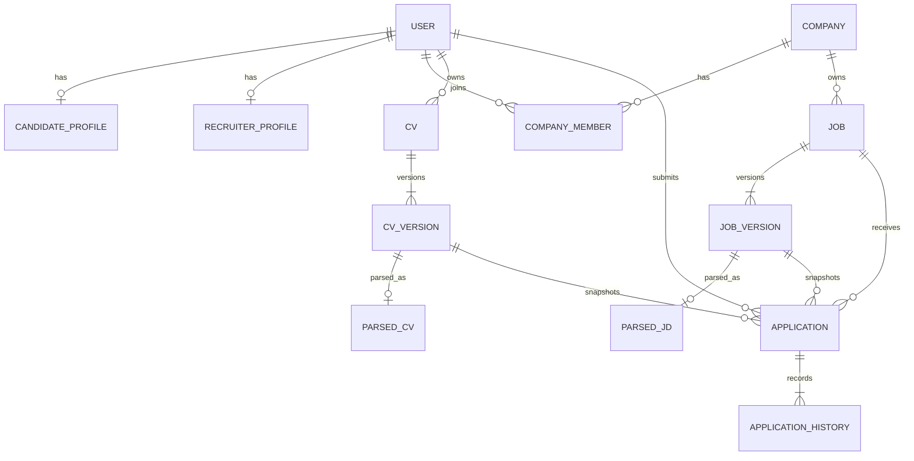
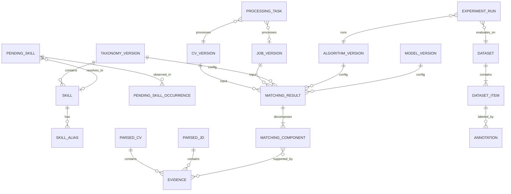

# Logical Data Design

| Thuộc tính | Giá trị |
|---|---|
| Mã tài liệu | DOC-DATA-001 |
| Phiên bản | 0.2.0 |
| Trạng thái | Working baseline |

## 1. Nguyên tắc dữ liệu

1. CV, JD, taxonomy, schema và kết quả matching đều có version; không ghi đè lịch sử đã dùng trong application/thí nghiệm.
2. Raw document, parsed data, normalized data và derived score là bốn lớp khác nhau.
3. Evidence là đối tượng hạng nhất, không nhúng tự do trong câu giải thích.
4. Service sở hữu dữ liệu của mình; tích hợp qua API/event, không cross-service foreign key.
5. PII tách khỏi feature/embedding/evaluation data.
6. ID dùng UUID/opaque ID ở ranh giới service; sequence nội bộ không được dùng như global identity.
7. Mọi bản ghi dẫn xuất phải lưu provenance và version đủ để tái lập.

## 2. Sơ đồ dữ liệu nghiệp vụ



## 3. Sơ đồ dữ liệu AI, taxonomy và nghiên cứu



## 4. Data ownership

| Bounded context | Entity sở hữu | Ghi chú |
|---|---|---|
| Identity/Auth | User, Role, Credential, RefreshSession | Không lưu CV/JD |
| Recruitment Core | Company, CompanyMember, Profile, CV metadata, Job, Application, history | Object key thay vì raw file trong DB |
| AI/Knowledge | ParsedCV, ParsedJD, Skill, Alias, PendingSkill, Evidence, Embedding, MatchingResult, ProcessingTask | Chỉ giữ PII tối thiểu/pseudonymous ref |
| Research/Evaluation | Dataset, DatasetItem, Annotation, ExperimentRun, MetricArtifact | Dữ liệu đã ẩn danh, access tách biệt |

Trong Docker Compose có thể dùng một PostgreSQL instance với database/schema riêng để tiết kiệm tài nguyên; ownership logic vẫn không thay đổi.

## 5. Entity catalog

| Mã | Entity | Trường cốt lõi | Bất biến chính |
|---|---|---|---|
| ENT-USER | User | id, email, status, createdAt | Email unique normalized; credential không log |
| ENT-COMP | Company | id, name, status, metadata | Job phải thuộc một Company |
| ENT-CMEM | CompanyMember | companyId, userId, role, status | Unique company-user active membership |
| ENT-CPRF | CandidateProfile | userId, display fields, consentVersion | Protected fields không vào matching |
| ENT-RPRF | RecruiterProfile | userId, company context | Quyền thực tế từ CompanyMember |
| ENT-CV | CV | id, ownerId, activeVersionId, status | Container logic, không ghi đè version |
| ENT-CVV | CVVersion | id, cvId, objectKey, hash, mime, size, language, status | Immutable source; hash/version unique theo policy |
| ENT-PCV | ParsedCV | id, cvVersionId, schemaVersion, revision, status, payload, confidence | Một revision immutable; confirmed revision explicit |
| ENT-JOB | Job | id, companyId, activeVersionId, lifecycleStatus | Company ownership bất biến |
| ENT-JVER | JobVersion | id, jobId, rawText, sourceHash, createdBy | Published snapshot immutable |
| ENT-PJD | ParsedJD | id, jobVersionId, schemaVersion, revision, payload, status | Required/preferred do Recruiter confirm |
| ENT-SKL | Skill | stableId, taxonomyVersionId, canonicalName, type, category, status | canonical normalized unique trong version |
| ENT-ALS | SkillAlias | skillStableId, alias, language, normalizedAlias | Alias không map hai skill active nếu không disambiguation |
| ENT-PSK | PendingSkill | id, fingerprint, rawTerm, status, suggestion, decision | Không tự thành Skill khi thiếu Admin action |
| ENT-PSO | PendingSkillOccurrence | pendingSkillId, sourceType, sourceRef, evidenceRef | PII-minimal; nhiều occurrence cho một proposal |
| ENT-EVD | Evidence | id, sourceVersionId, fieldPath, textSpan, offsets, provenance, confidence | Span/hash phải xác minh được với source version |
| ENT-APP | Application | id, candidateId, jobId, cvVersionId, jobVersionId, status, appliedAt | Unique Candidate–Job toàn vòng đời; snapshot version |
| ENT-APH | ApplicationHistory | applicationId, from, to, actor, reason, occurredAt | Append-only |
| ENT-MAT | MatchingResult | id, applicationId hoặc experimentRunId, input refs, all versions, baseScore, penalty, finalScore, status, flags | Product result phải có Application; offline result thuộc ExperimentRun; immutable/idempotent |
| ENT-MCO | MatchingComponent | resultId, type, rawScore, normalizedScore, weight, applicable, confidence | Tổng hợp phải khớp result trong tolerance |
| ENT-TSK | ProcessingTask | id, type, subjectRef, state, attempt, idempotencyKey, errorCode | Idempotency key unique theo task type/version |
| ENT-ALG | AlgorithmVersion | id, name, config, codeRef, createdAt | Config/content hash immutable |
| ENT-MOD | ModelVersion | id, provider, model, revision, configHash | Không chỉ lưu tên model mơ hồ |
| ENT-TAX | TaxonomyVersion | id, semanticVersion, parentId, changeSummary | Published version immutable |
| ENT-DS | Dataset | id, version, scope, license/consent, splitPolicy | Không chứa PII export |
| ENT-DSI | DatasetItem | datasetId, pseudonymousDocRef, type, split, groupKey | Group split chống leakage |
| ENT-ANN | Annotation | item/pairId, annotatorPseudonym, label, rubricVersion, confidence | Không overwrite label; adjudication riêng |
| ENT-EXP | ExperimentRun | id, datasetVersion, config versions, codeRef, seed, environment, metrics | Đủ metadata tái lập |

## 6. Hợp đồng ParsedCV v1

```json
{
  "schemaVersion": "parsed-cv/1.0",
  "document": {
    "cvVersionId": "uuid",
    "language": "vi|en|mixed|unknown",
    "sourceHash": "sha256",
    "parserVersion": "string"
  },
  "skills": [
    {
      "raw": "ReactJS",
      "canonicalSkillId": "skill-uuid|null",
      "normalizationStatus": "KNOWN|PENDING|UNRESOLVED",
      "evidenceIds": ["evidence-uuid"],
      "confidence": 0.94,
      "provenance": "EXTRACTED|USER_CONFIRMED|USER_ASSERTED"
    }
  ],
  "experiences": [
    {
      "titleRaw": "Backend Developer",
      "titleCanonical": "BACKEND_DEVELOPER|null",
      "companyRedacted": "string|null",
      "startMonth": "2023-01|null",
      "endMonth": "2025-06|null",
      "isCurrent": false,
      "responsibilities": ["string"],
      "skillIds": ["skill-uuid"],
      "evidenceIds": ["evidence-uuid"],
      "confidence": 0.88
    }
  ],
  "projects": [],
  "education": [],
  "certificates": [],
  "languages": [],
  "summary": {
    "totalExperienceMonths": 30,
    "overallConfidence": 0.86,
    "qualityFlags": []
  }
}
```

Quy tắc:

- Không đặt name/email/phone/address/photo vào payload dùng cho AI matching.
- `companyRedacted` có thể bỏ hoàn toàn khỏi feature; nếu giữ chỉ để Candidate review.
- `evidenceIds` trỏ entity evidence, không nhúng raw CV tràn lan.
- `totalExperienceMonths` là dữ liệu dẫn xuất; matching phải tính experience liên quan theo tiêu chí JD, không dùng tổng số tháng một cách mù quáng.

## 7. Hợp đồng ParsedJD v1

```json
{
  "schemaVersion": "parsed-jd/1.0",
  "document": {
    "jobVersionId": "uuid",
    "language": "vi|en|mixed|unknown",
    "sourceHash": "sha256",
    "parserVersion": "string"
  },
  "title": {
    "raw": "Senior Backend Engineer",
    "canonicalFamily": "BACKEND",
    "level": "SENIOR",
    "confidence": 0.93,
    "evidenceIds": ["evidence-uuid"]
  },
  "requirements": {
    "requiredSkills": [
      {
        "raw": "Java",
        "canonicalSkillId": "skill-uuid",
        "criticality": "CRITICAL|NORMAL",
        "minimumMonths": 24,
        "evidenceIds": ["evidence-uuid"],
        "confidence": 0.96,
        "confirmedByRecruiter": true
      }
    ],
    "preferredSkills": [],
    "minimumRelevantExperienceMonths": 36,
    "education": [],
    "languages": []
  },
  "responsibilities": [],
  "overallConfidence": 0.9,
  "qualityFlags": []
}
```

`requiredSkills`, `preferredSkills`, `criticality` và các hard constraint chỉ được coi là chính thức sau Recruiter confirmation.

## 8. Evidence model

| Field | Ý nghĩa |
|---|---|
| id | ID ổn định trong source version |
| sourceType | CV hoặc JD |
| sourceVersionId | CVVersion/JobVersion |
| fieldPath | Ví dụ `experiences[0].responsibilities[2]` |
| startOffset/endOffset | Offset trên normalized source text |
| textHash | Xác minh span không bị thay đổi |
| redactedText | Đoạn tối thiểu được phép hiển thị/xử lý |
| provenance | EXTRACTED, USER_CONFIRMED, USER_ASSERTED, RECRUITER_CONFIRMED, INFERRED |
| confidence | `[0,1]` của extraction/provenance |
| createdByVersion | Parser/schema version |

Nếu không thể xác định offset đáng tin cậy, lưu section/page anchor và quality flag; không tạo offset giả.

## 9. MatchingResult uniqueness và version tuple

Logical key đề xuất:

```text
(cv_version_id,
 job_version_id,
 parsed_cv_revision,
 parsed_jd_revision,
 taxonomy_version_id,
 algorithm_version_id,
 embedding_model_version_id)
```

Recompute với cùng tuple phải idempotent. Thay bất kỳ thành phần nào tạo result mới; `supersedesResultId` liên kết lịch sử.

## 10. Trạng thái dữ liệu

| Entity | Trạng thái |
|---|---|
| CVVersion | Uploaded, Queued, Processing, Parsed, NeedsReview, Confirmed, Rejected, Failed, Superseded, Deleted |
| ParsedCV/ParsedJD | Processing, Parsed, NeedsReview, Confirmed, Failed, Stale |
| Job | Draft, Published, Closed |
| Application | Submitted, UnderReview, Shortlisted, Rejected, Withdrawn |
| ProcessingTask | Pending, Processing, Retrying, Completed, NeedsReview, Rejected, Failed, DeadLetter, Cancelled |
| PendingSkill | PendingReview, Deferred, Approved, EditedAndApproved, Merged, Rejected |
| MatchingResult | Pending, Completed, Degraded, InsufficientData, Failed, Superseded |

Rejected và Withdrawn là terminal state của Application; unique Candidate–Job áp dụng cho toàn vòng đời. Job Closed không mở lại trong MVP. Trạng thái parsing của JD/CV thuộc ParsedJD/ParsedCV/Task, không trộn vào lifecycle Job. Với upload/parsing, Rejected là validation failure trước xử lý; Failed là lỗi xử lý terminal.

Transition chi tiết nằm trong `03-business-processes.md`; database phải enforce transition ở application/domain layer và optimistic version.

## 11. Index và constraint tối thiểu

- Unique normalized email.
- Unique `(company_id, user_id)` cho membership active theo policy.
- Unique source/version sequence trong CV/Job.
- Unique Application toàn vòng đời `(candidate_id, job_id)`; không dùng partial index theo active status.
- Unique processing `idempotency_key`.
- Unique matching version tuple.
- Index `job(company_id, lifecycle_status, published_at)`.
- Index `application(job_id, status, applied_at)`.
- Index `pending_skill(status, fingerprint, occurrence_count)`.
- Index `processing_task(state, next_retry_at)`.
- pgvector index chỉ tạo sau khi đo query plan/dataset size; không mặc định một index type.

## 12. Retention và xóa dữ liệu

| Dữ liệu | Baseline |
|---|---|
| Raw CV | [CẦN XÁC NHẬN] Theo consent và thời gian đồ án; private object |
| Parsed CV | Xóa/anonymize theo raw CV trừ phần aggregate được phép |
| Application snapshot | Giữ theo policy tuyển dụng và consent; không giữ vô hạn mặc định |
| Audit security/taxonomy | Giữ đủ để truy vết, không lưu raw PII trong message |
| Evaluation dataset | Chỉ bản có quyền sử dụng và pseudonymized; version immutable |
| LLM prompt/response | Không lưu raw PII; retention tối thiểu/disabled nếu provider cho phép |

Retention cụ thể phải được freeze trong DEC trước khi dùng dữ liệu thật.

## 13. Migration và compatibility

- Thêm field optional trong minor schema; consumer bỏ qua field lạ.
- Xóa/đổi nghĩa field cần major schema và migration/reparse plan.
- Taxonomy merge không đổi stable identity lịch sử; alias/redirect giải quyết canonical mới.
- Backfill/reprocess chạy batch có checkpoint/idempotency/rate limit.
- Database migration theo forward-only script; destructive migration cần backup và xác nhận riêng.
