# AI, Normalization và Explainable Matching Design

| Thuộc tính | Giá trị |
|---|---|
| Mã tài liệu | DOC-AI-001 |
| Phiên bản | 0.2.0 |
| Trạng thái | Method baseline — weights/thresholds chưa freeze |

## 1. Mục tiêu thiết kế

Thiết kế một pipeline có thể chạy không phụ thuộc external LLM, có tiêu chí rõ, tái lập được và giải thích bằng evidence. AI hỗ trợ hiểu ngữ nghĩa và thuật ngữ; luật nghiệp vụ giữ hard constraint/logic tuyển dụng; con người xác nhận dữ liệu quan trọng.

Trong sản phẩm MVP, pipeline matching chỉ được kích hoạt cho Candidate–Job đã có Application hợp lệ; không cung cấp personalized recommendation trước apply. Evaluation/development có thể chạy cặp CV–JD offline nhưng không làm thay đổi product scope.

## 2. Non-goals

- Không gửi CV+JD cho LLM để xin một điểm tổng duy nhất.
- Không auto-reject, dự đoán “khả năng thành công” hoặc tính cách.
- Không coi LLM output là authoritative, không cho LLM tạo evidence hoặc claim thiếu fact/component/evidence tương ứng.
- Không dùng PII/protected attributes làm feature.
- Không coi cosine similarity là mức phù hợp cuối cùng.
- Không claim hỗ trợ mọi vị trí CNTT với chất lượng như nhau nếu chưa đánh giá.

## 3. Pipeline tổng thể

```mermaid
flowchart LR
    DOC["CV/JD text"] --> EXT["Text extraction + language"]
    EXT --> RED["PII separation/redaction"]
    RED --> PAR["Structured parsing"]
    PAR --> NORM["Taxonomy normalization"]
    NORM -->|"Known"| STRUCT["Confirmed structured data"]
    NORM -->|"Unknown"| PEND["PendingSkill"]
    PEND --> LLM["Optional LLM suggestion"]
    LLM --> ADM["Admin review"]
    ADM --> TAX["Versioned taxonomy"]
    TAX --> STRUCT
    STRUCT --> RULE["Rule components"]
    STRUCT --> EMB["Semantic embeddings"]
    RULE --> AGG["Versioned aggregation + penalties"]
    EMB --> AGG
    AGG --> EVD["Evidence selection"]
    EVD --> TPL["Template explanation"]
    TPL --> OPT["Optional validated LLM wording"]
    OPT --> OUT["Score + components + evidence + flags"]
```



## 4. Parsing strategy

### 4.1 Các lớp xử lý

1. **Extraction**: PDF text → normalized text, page/offset mapping.
2. **Language**: `vi`, `en`, `mixed`, `unknown` ở document/section level nếu cần.
3. **PII separation**: tách vùng identity/contact khỏi feature text.
4. **Section detection**: experience, project, skill, education, certificate, language.
5. **Entity extraction**: rules/dictionary/model cục bộ; không khóa vào một model cụ thể.
6. **Temporal normalization**: date ranges ở độ phân giải tháng.
7. **Validation**: schema, range, duplicate, impossible dates.
8. **Confidence/provenance**: theo field, không chỉ một confidence chung.
9. **Human confirmation**: Candidate/Recruiter sửa và xác nhận.

### 4.2 Confidence

Confidence không được dùng như “xác suất đúng” nếu mô hình chưa calibration. Ban đầu dùng score vận hành `[0,1]` dựa trên:

- Method: exact rule/dictionary, model extraction, inferred.
- Evidence completeness.
- Schema validity.
- Agreement giữa nhiều extractor (nếu có).
- Human confirmation.

Các nhãn nên dùng:

| Khoảng đề xuất | Nhãn vận hành | Hành vi |
|---|---|---|
| `>= 0.85` | High | Hiển thị bình thường, vẫn cho sửa |
| `0.60–0.85` | Medium | Highlight review |
| `< 0.60` | Low | NeedsReview; không dùng hard constraint tự động |

Ngưỡng phải calibration/pilot trước khi freeze.

## 5. Skill taxonomy

### 5.1 Cấu trúc tối thiểu

```text
Skill
├── stable_id
├── canonical_name
├── type: language | framework | library | database | cloud | devops | testing | data_ai | security | methodology | soft_skill | other
├── category/job_family
├── aliases[language, normalized_form]
├── relations: broader | narrower | related | supersedes
├── status: active | deprecated
└── taxonomy_version
```

Không mặc định quan hệ `related` đồng nghĩa với thay thế được. Ví dụ Java và JavaScript không liên quan chỉ vì chuỗi gần nhau; Spring và Spring Boot cần disambiguation theo context.

### 5.2 Normalization cascade

1. Unicode/case/punctuation normalization có bảo toàn token đặc biệt như `C#`, `C++`, `.NET`.
2. Exact canonical match.
3. Exact normalized alias.
4. Context-aware alias/disambiguation.
5. Fuzzy candidate generation để gợi ý, không auto-map khi ambiguity cao.
6. Semantic candidate generation từ description/context.
7. Nếu không đạt policy threshold → `UNRESOLVED` + PendingSkill.

### 5.3 Unknown term + LLM + Admin

LLM input chỉ gồm:

- Raw term.
- Một đoạn context đã redacted.
- Document language.
- Candidate taxonomy matches (ID/name/type).
- JSON schema output.

LLM output proposal:

```json
{
  "canonicalName": "string",
  "type": "enum",
  "category": "string|null",
  "aliases": ["string"],
  "relatedSkillIds": ["uuid"],
  "actionHint": "CREATE|MERGE|REJECT|UNKNOWN",
  "targetSkillId": "uuid|null",
  "confidence": 0.0,
  "rationale": "short string"
}
```

Guardrail:

- Validate schema/enum/length.
- Không cho LLM tạo/approve ID thật.
- Suggestion confidence chỉ để ưu tiên review, không phải ground truth.
- Không gửi name/email/phone/raw full CV.
- Không có LLM vẫn tạo PendingSkill với local candidates.
- Nếu dùng LLM hỗ trợ field parser không chắc chắn, output chỉ là proposal gắn confidence/provenance và vẫn phải qua cùng user confirmation; không được ghi đè parser revision gốc.

## 6. Biểu diễn ngữ nghĩa

Tạo embedding riêng cho:

- CV experience/project responsibility text đã redacted.
- JD responsibility/requirement text.
- Có thể tạo embedding theo section thay vì ghép toàn tài liệu để giữ evidence.

Yêu cầu chọn model:

- Hỗ trợ Việt–Anh/mixed.
- Có giấy phép phù hợp và chạy được trong tài nguyên đồ án hoặc API có fallback.
- Model/revision/pooling/max length/preprocessing được version.
- Đánh giá retrieval riêng; không chọn chỉ vì phổ biến.

Không embed PII hoặc raw contact section. Vector chỉ là dữ liệu dẫn xuất; khi source/model đổi phải re-embed.

## 7. Thành phần matching

Mỗi component trả:

```text
score ∈ [0,1]
applicable: boolean
confidence ∈ [0,1]
weight
matched facts[]
missing facts[]
uncertain facts[]
evidence IDs[]
```

| Component | Ý nghĩa | Cách tính baseline |
|---|---|---|
| `required_skill` | Độ phủ kỹ năng bắt buộc | Weighted coverage theo canonical/acceptable relation và evidence strength |
| `preferred_skill` | Độ phủ kỹ năng ưu tiên | Tương tự required nhưng không hard penalty |
| `experience` | Kinh nghiệm liên quan | Union tháng liên quan / minimum, cap 1.0 |
| `title_level` | Job family và seniority | Taxonomy title/level compatibility, không chỉ string similarity |
| `responsibility_semantic` | Ngữ nghĩa công việc/dự án | Similarity section-level có calibration |
| `education_language` | Điều kiện học vấn/ngoại ngữ | Chỉ applicable khi JD có yêu cầu đã confirm |

Soft skills không được cho trọng số cao chỉ từ danh sách tự khai; cần evidence hoặc giữ ở informative component.

## 8. Công thức hybrid v0

Với component `i`:

- `s_i ∈ [0,1]`: component score.
- `w_i`: weight cấu hình.
- `a_i ∈ {0,1}`: tiêu chí có áp dụng hay không.
- `c_i ∈ [0,1]`: confidence dùng cho quality, không âm thầm trừ điểm.

```text
base_score = Σ(a_i × w_i × s_i) / Σ(a_i × w_i)
result_confidence = Σ(a_i × w_i × c_i) / Σ(a_i × w_i)
final_score = 100 × clamp(base_score - required_penalty, 0, 1)
```

Nếu `Σ(a_i × w_i) = 0`, trả `INSUFFICIENT_DATA`.

### Weight set khởi đầu [ĐỀ XUẤT]

| Component | Weight |
|---|---:|
| Required skills | 0.35 |
| Preferred skills | 0.10 |
| Relevant experience | 0.20 |
| Title/level | 0.10 |
| Responsibility semantic | 0.15 |
| Education/language | 0.10 |

Weight được renormalize khi component không applicable. Đây là giả thuyết khởi đầu, không phải kết luận; phải so sánh nhiều weight set/ablation trên validation, không tune trên test.

### Penalty candidate [ĐỀ XUẤT]

```text
required_penalty = min(
  0.35,
  0.15 × missing_critical_count +
  0.04 × missing_normal_required_count
)
```

Không hard-code trước pilot. Có thể thay bằng penalty theo importance normalized để tránh JD dài bị phạt quá mức. Bất kể penalty, hệ thống chỉ tạo flag `MISSING_CRITICAL_REQUIREMENT`, không auto-reject.

## 9. Skill match và evidence strength

### 9.1 Match degree candidate

| Quan hệ | Giá trị khởi đầu |
|---|---:|
| Cùng canonical skill | 1.00 |
| Alias đã approve | 1.00 |
| Narrower skill được rule cho phép thay thế | 0.80–1.00 |
| Related/transferable có rule theo job family | 0.40–0.70 |
| Semantic-only, chưa xác nhận | Không auto-match hoặc cap thấp |
| Pending/unresolved | 0 cho hard score; hiển thị uncertain |

### 9.2 Evidence strength candidate

| Provenance | Strength khởi đầu |
|---|---:|
| Recruiter/Candidate confirmed work/project evidence | 1.00 |
| Extracted work/project evidence high confidence | 0.90 |
| Certificate/education evidence | 0.75 |
| Chỉ liệt kê trong skill section | 0.60 |
| User asserted không source evidence | 0.50 |
| Inferred/semantic-only | ≤0.30, không dùng hard constraint |

Các giá trị là candidate config cần ablation. Không kết luận “biết kỹ năng” chỉ vì xuất hiện keyword.

## 10. Tính kinh nghiệm liên quan

1. Chuẩn hóa interval theo tháng `[start, end)`.
2. Chọn experience/project liên quan skill/job family bằng evidence/rule.
3. Lấy union các interval để tránh cộng trùng công việc song song.
4. Không làm tròn lên năm.
5. Nếu thiếu start/end, lưu uncertainty và không tự suy đoán quá mức.
6. Score baseline: `min(relevant_months / required_months, 1)` nếu requirement > 0.
7. Nếu JD không yêu cầu số tháng, component experience có thể dùng ordinal/semantic rule hoặc không applicable theo config.

## 11. Semantic score

- Tính similarity ở section/responsibility level.
- Aggregate top evidence pairs bằng mean/max có giới hạn, không dùng một cặp duy nhất để đại diện toàn tài liệu.
- Raw cosine không mặc nhiên nằm `[0,1]`; phải transform/calibrate và version cách transform.
- Lưu top contributing section pairs làm evidence.
- Đánh giá model trên retrieval/ranking validation set Việt–Anh trước khi freeze.

## 12. Explanation contract

Explanation trước hết là cấu trúc, sau đó mới là câu chữ:

```json
{
  "summaryCode": "PARTIAL_MATCH",
  "facts": [
    {
      "factId": "fact-1",
      "type": "MATCHED_REQUIRED_SKILL",
      "componentId": "component-1",
      "messageTemplate": "Có bằng chứng về {skill}",
      "variables": {"skill": "Java"},
      "evidenceIds": ["evidence-cv-1", "evidence-jd-1"]
    }
  ],
  "limitations": ["LOW_INPUT_CONFIDENCE"],
  "generator": "TEMPLATE|LLM_VALIDATED"
}
```

Quy tắc:

- “Thiếu” phải diễn đạt là “không tìm thấy bằng chứng trong CV hiện tại”, trừ khi Candidate xác nhận không có.
- Không suy luận thái độ, năng lực, khả năng trúng tuyển.
- LLM rewrite chỉ được dùng `factId` cho phép; validator so khớp entity/number/negation.
- Validation fail/timeout → template, score không đổi.
- LLM output là non-authoritative; mọi câu không được component/fact/evidence allow-list hỗ trợ phải bị loại thay vì hiển thị.

## 13. Quality flags

| Flag | Ý nghĩa |
|---|---|
| LOW_INPUT_CONFIDENCE | Parse/confirmation chưa đủ tin cậy |
| PENDING_TAXONOMY_TERM | Có term chưa được duyệt |
| DEGRADED_SEMANTIC | Thiếu embedding/model, đang rule-only |
| STALE_TAXONOMY | Taxonomy mới hơn result |
| STALE_ALGORITHM | Algorithm active mới hơn result |
| OUTSIDE_EVALUATED_SCOPE | Job family/language chưa được đánh giá đủ |
| INSUFFICIENT_DATA | Không đủ component để tính điểm có nghĩa |
| MISSING_CRITICAL_REQUIREMENT | Không tìm thấy evidence cho hard requirement |

## 14. Versioning và reprocessing

MatchingResult bắt buộc lưu:

- CVVersion + ParsedCV revision/schema.
- JobVersion + ParsedJD revision/schema.
- TaxonomyVersion.
- Normalizer version.
- Embedding model/config version.
- Algorithm/weight/penalty version.
- Explanation generator/prompt version nếu có.

Khi version thay đổi:

1. Đánh dấu result stale theo impact.
2. Giữ result cũ immutable.
3. Tạo batch task có checkpoint/rate limit/idempotency.
4. Tạo result mới và liên kết `supersedes`.
5. Application audit vẫn xem được result tại thời điểm quyết định.

## 15. Failure và fallback matrix

| Thành phần lỗi | Hành vi |
|---|---|
| PDF extraction | NeedsReview/manual input; OCR ngoài MVP |
| Parser/model | Retry nếu transient; rule/dictionary fallback nếu có |
| Taxonomy service | Dùng version cached/pinned; không auto-create skill |
| Embedding/model | Rule-only degraded result hoặc Pending |
| LLM taxonomy proposal | PendingSkill local, Admin review bình thường |
| LLM explanation | Template explanation |
| Queue | Outbox giữ event; retry khi broker phục hồi |
| Matching batch | Result cũ còn phục vụ; task retry/checkpoint |

## 16. Thí nghiệm bắt buộc cho phương pháp

| Mã | So sánh | Trả lời |
|---|---|---|
| EXP-PAR-01 | Rule/dictionary vs pipeline kết hợp | RQ-01 |
| EXP-MAT-01 | Rule-only vs lexical vs embedding-only vs hybrid | RQ-02 |
| EXP-MAT-02 | Hybrid bỏ từng component | RQ-03 |
| EXP-MAT-03 | Không penalty vs penalty candidates | RQ-03 |
| EXP-EVD-01 | Template vs optional validated LLM wording | RQ-04 |
| EXP-TAX-01 | Local candidates vs local+LLM suggestion | RQ-05 |
| EXP-PERF-01 | 1 worker vs nhiều worker, dataset tăng dần | RQ-06 |

Chi tiết protocol/metric nằm trong `10-evaluation-plan.md`.

## 17. Điều kiện freeze Algorithm v1

- ParsedCV/ParsedJD schema và taxonomy v1 đã freeze.
- Có validation set độc lập test set.
- Baseline chạy cùng input/split.
- Weight/penalty được chọn bằng validation và có ablation.
- Explanation validator đạt quality gate.
- Mọi config/model/code reference được lưu trong AlgorithmVersion.
- Limitations theo job family/ngôn ngữ được ghi rõ.
