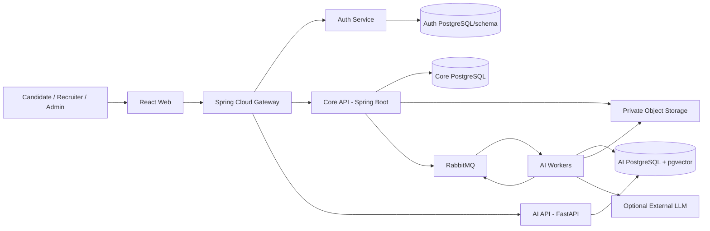

# System Architecture và Scaling Strategy

| Thuộc tính | Giá trị |
|---|---|
| Mã tài liệu | DOC-ARCH-001 |
| Phiên bản | 0.2.0 |
| Trạng thái | Working baseline |

## 1. Mục tiêu kiến trúc

- Tách tác vụ AI nặng/bất đồng bộ khỏi nghiệp vụ tuyển dụng.
- Giữ hệ thống đủ gọn cho một người phát triển và demo bằng Docker Compose.
- Bảo toàn ranh giới dữ liệu để có thể scale/split service mà không viết lại nghiệp vụ.
- Không phụ thuộc external LLM để duy trì luồng cốt lõi.
- Hỗ trợ versioning, audit, idempotency và reproducible experiments.

## 2. Quyết định định hướng

| Nội dung | Baseline |
|---|---|
| Kiểu kiến trúc | Bounded-context services, event-driven cho tác vụ dài |
| Deployable cốt lõi | Web, Spring Cloud Gateway, Auth Service, Core API, AI API/Worker |
| Data | PostgreSQL + pgvector; ownership theo context |
| Queue | RabbitMQ cho parse, embedding, bulk/recompute |
| File | MinIO private là chính; local private volume là fallback qua cùng storage interface |
| Triển khai | Docker Compose; không cần Kubernetes/Eureka/service mesh trong MVP |
| Scale | Stateless API/worker, tăng replica, queue backpressure, versioned contracts |

## 3. Container view



`AI API` và `AI Worker` có thể cùng codebase/image nhưng chạy process/replica khác nhau. Đây là cách scale worker mà không nhân API không cần thiết.

## 4. Ranh giới service

### 4.1 Core API — Spring Boot

Sở hữu:

- Company/CompanyMember.
- Candidate/Recruiter profile.
- CV metadata/version/object reference.
- Job/JobVersion.
- Application/history.
- Consent và workflow audit nghiệp vụ.
- Outbox phát event.

Không sở hữu:

- Parsing/matching implementation.
- Embeddings/taxonomy/algorithm result chi tiết.
- LLM credential/prompt.

### 4.2 AI API/Worker — Python/FastAPI

Sở hữu:

- ParsedCV/ParsedJD.
- Taxonomy, alias, PendingSkill.
- Embeddings.
- MatchingResult/Component/Evidence.
- ProcessingTask AI.
- Algorithm/model/version config.
- Evaluation execution metadata.

Worker xử lý message; API phục vụ query/status/admin/evaluation có kiểm soát.

### 4.3 Auth Service và API Gateway

Theo DEC-006 và DEC-020, Auth Service và Spring Cloud Gateway được tách riêng:

- Auth sở hữu credential, account status, role, refresh session và phát JWT ký bất đối xứng.
- Gateway route, kiểm tra token ở lớp biên, CORS/rate limit/request-size/correlation ID.
- Core/AI vẫn verify token và authorize resource; không tin mù identity header.
- CompanyMember/ownership thuộc Core, không sao chép toàn bộ vào Auth hoặc token dài hạn.
- Route dùng Docker Compose DNS; không cần Eureka trong MVP.

Chi tiết contract tại `16-api-service-contracts.md`.

#### Baseline phiên bản Gateway đã khóa

| Thành phần | Phiên bản/cấu hình |
|---|---|
| Java | 21 LTS |
| Spring Boot | 4.0.7 |
| Spring Cloud BOM | 2025.1.2 (Oakwood) |
| Spring Cloud Gateway | 5.0.2, Server WebFlux |
| Starter | `org.springframework.cloud:spring-cloud-starter-gateway-server-webflux` |
| Build | Maven Wrapper; dependency version do Spring Boot parent và Spring Cloud BOM quản lý |
| Runtime | Reactor Netty; không đóng gói WAR/Servlet container |

Không pin riêng Spring Security, Reactor hoặc Netty nếu BOM đã quản lý. Không tự nâng minor/patch giữa phase; chỉ nâng vì CVE nghiêm trọng hoặc lỗi blocking, kèm regression test.

## 5. Database deployment

### Demo/MVP

- Một PostgreSQL server/container để tiết kiệm RAM.
- Database/schema tách theo owner: `auth`, `core`, `ai`.
- Credential khác nhau; mỗi service chỉ có quyền schema/database của mình.
- pgvector chỉ ở AI database/schema.

### Scale

- Chuyển từng logical database sang instance riêng mà không đổi contract.
- Read replica cho truy vấn read-heavy sau khi có nhu cầu.
- Partition/audit/archive theo dữ liệu thực, không làm sớm.
- Không cross-database join; dùng API composition, snapshot hoặc event projection.

Việc dùng “3 database” không đồng nghĩa phải chạy ba PostgreSQL container trong máy demo.

## 6. Giao tiếp đồng bộ và bất đồng bộ

| Use case | Kiểu | Lý do |
|---|---|---|
| Login/token | Sync | User cần kết quả ngay |
| CRUD Company/Job/Application | Sync | Transaction nghiệp vụ ngắn |
| Upload CV | Sync accept + async process | Trả task nhanh, parse có thể lâu |
| Parse JD | Async mặc định; sync form validation | Có model/normalization/unknown term |
| Xem result hiện có | Sync query | Read path |
| Match một cặp on-demand | Sync nếu dưới timeout; nếu không tạo task | UX và bảo vệ tài nguyên |
| Bulk application matching/recompute | Async | Fan-out, retry, backpressure |
| Taxonomy updated | Event | Nhiều bản parse/result bị ảnh hưởng |

## 7. Event catalog v1

| Mã | Routing key | Producer | Consumer | Payload tham chiếu |
|---|---|---|---|---|
| EVT-CV-01 | `cv.uploaded.v1` | Core | AI Worker | cvVersionId, objectRef, sourceHash |
| EVT-CV-02 | `cv.confirmed.v1` | Core/AI boundary | AI Worker | cvVersionId, parsedRevision |
| EVT-JOB-01 | `job.version.created.v1` | Core | AI Worker | jobVersionId |
| EVT-JOB-02 | `job.published.v1` | Core | AI Worker | jobId, jobVersionId |
| EVT-TAX-01 | `taxonomy.published.v1` | AI/Admin | AI Worker | taxonomyVersionId, changeSetRef |
| EVT-MAT-01 | `matching.requested.v1` | Core/AI API | AI Worker | input/version refs |
| EVT-MAT-02 | `matching.completed.v1` | AI Worker | Core projection/notification | resultId, subject refs, status |
| EVT-APP-01 | `application.submitted.v1` | Core | AI Worker | applicationId, CV/Job version refs |

Envelope bắt buộc:

```json
{
  "eventId": "uuid",
  "eventType": "cv.uploaded.v1",
  "schemaVersion": 1,
  "occurredAt": "ISO-8601 UTC",
  "correlationId": "uuid",
  "causationId": "uuid|null",
  "idempotencyKey": "string",
  "producer": "core-service",
  "data": {"objectReferenceOnly": true}
}
```

Không đặt raw CV/JD, email, phone hoặc token truy cập dài hạn trong event.

## 8. Consistency patterns

- **Local transaction + outbox**: lưu business change và outbox cùng transaction.
- **At-least-once delivery + idempotent consumer**: không giả định exactly-once.
- **Immutable result + current pointer**: giữ audit khi version đổi.
- **Snapshot at application**: Application trỏ CVVersion/JobVersion, không copy PII không cần thiết.
- **API composition**: Core/UI lấy AI result theo ID/batch endpoint; tránh N+1.
- **Projection**: Core có thể cache `matchingStatus/currentResultId`, không copy explanation blob làm source of truth.

## 9. API contract principles

- REST JSON có `/api/v1` hoặc version qua media type thống nhất.
- Error chuẩn: `code`, `message`, `details`, `correlationId`, không lộ stack trace.
- Cursor/page pagination cho collections.
- Idempotency-Key cho upload/apply/retry/recompute.
- ETag/row version cho edit ParsedCV/ParsedJD/Application.
- Batch endpoint lấy nhiều MatchingResult để tránh N+1.
- OpenAPI sinh contract test; thay đổi breaking cần major version.

## 10. Resilience

| Failure | Thiết kế |
|---|---|
| AI down | Core CRUD/apply vẫn hoạt động; result Pending/Unavailable |
| RabbitMQ down | Outbox giữ event; publisher retry; không mất business transaction |
| Worker crash giữa task | Message redelivery + idempotency; lease/heartbeat nếu task dài |
| LLM timeout/rate limit | Local candidate/template fallback; circuit breaker/budget |
| Object storage timeout | Transient retry; signed URL/token ngắn hạn; không nhét file vào queue |
| Poison message | Validate schema, retry hữu hạn, DLQ và Admin review |
| Taxonomy/model change | Pin version cho task/result; reprocess tạo bản mới |
| Partial database outage | Health/readiness; không báo success nếu outbox/result chưa bền vững |

## 11. Scaling strategy

### Stage 0 — Local development

- Một instance mỗi ứng dụng; một PostgreSQL container; RabbitMQ một node; MinIO một node; AI model chỉ load trong AI service/worker.
- Dataset nhỏ; exact vector search có thể đủ.
- Baseline máy local: i5-11300H, RAM 16 GB, GTX 1650; không chạy local LLM lớn.

### Stage 1 — Demo/load test

- Tách AI API và 1–N worker replicas.
- Queue theo task type/priority; prefetch hợp lý.
- pgvector index chọn sau EXPLAIN/benchmark.
- Cache taxonomy/model trong worker theo version.

### Stage 2 — Tăng dữ liệu/người dùng

- Autoscale worker theo queue depth/processing age.
- Tách PostgreSQL logical DB sang instance riêng nếu có bottleneck.
- Read model/batch endpoint cho ranking.
- Partition/archive task/audit/result theo retention.
- Rate limit reprocessing và external LLM.

### Stage 3 — Production extension

- Orchestrator/managed services chỉ khi có nhu cầu thật.
- Observability tập trung, secret manager, HA database/broker.
- Company Admin/multi-tenant hardening.

Không cần triển khai Stage 3 trong DATN; cần chứng minh Stage 0 và benchmark một phần Stage 1.

## 12. Security architecture

- JWT ký bất đối xứng, access token ngắn; refresh/revocation theo Auth design.
- Mỗi service verify audience/issuer/signature; không tin header identity từ internet.
- Least-privilege DB user và object storage access.
- Signed URL/token ngắn hạn cho worker; object private.
- PII redaction trước embedding/external LLM.
- Structured log có allow-list; không log raw request/file/token.
- Audit append-only cho status/taxonomy/admin access.
- Rate limit upload, auth, LLM và expensive matching endpoint.

## 13. Observability

Tối thiểu:

- Correlation ID xuyên HTTP → outbox → event → worker → result.
- Metrics: API latency/error, queue depth/age, task duration/state, retry/DLQ, LLM call/fallback, matching latency.
- Structured logs với event/task/result/version IDs.
- Health: liveness chỉ process; readiness kiểm tra dependency cần thiết.
- Không bắt buộc Jaeger/ELK trong MVP; log/metrics phải đủ tái hiện demo và thí nghiệm.

## 14. Deployment profile Docker Compose

Các container tối thiểu:

1. web.
2. gateway.
3. auth-service.
4. core-api.
5. ai-api.
6. ai-worker.
7. postgres có logical DB/schema.
8. rabbitmq.
9. minio; local volume là fallback.

Không thêm Redis, Eureka hoặc nhiều PostgreSQL container nếu chưa có requirement/benchmark chứng minh. API Gateway riêng đã chốt theo DEC-020.

Chỉ Web và Gateway được expose. Auth/Core/AI, RabbitMQ, PostgreSQL và MinIO nằm trong Docker internal network; cấu hình production không map port nội bộ ra host. Dùng compose base cùng override dev/prod để dev có thể mở port debug mà không làm yếu production profile. Local là môi trường phát triển/demo bắt buộc; chỉ public VPS sau khi stack local ổn định.

## 15. Architecture fitness checks

- Stop AI: Core cho xem Job và apply được.
- Publish duplicate event: một logical result.
- Scale từ 1 lên 2 worker: không duplicate và throughput tăng có đo.
- Service không truy cập schema/database của service khác.
- Event không chứa PII/raw document.
- Mỗi result tái lập được từ version tuple.
- Fresh `docker compose up` + migration + seed chạy trên máy demo đã ghi cấu hình.

## 16. Trạng thái quyết định kiến trúc

1. DEC-007/008/009/010/020/021/023 đã freeze ngày 2026-07-20.
2. Không tự nâng Gateway stack; chỉ review vì CVE nghiêm trọng/lỗi blocking và chạy regression.
3. Timeout cụ thể của API sync và ngưỡng chuyển async vẫn là policy cấu hình cần benchmark, không làm đổi service boundary.


