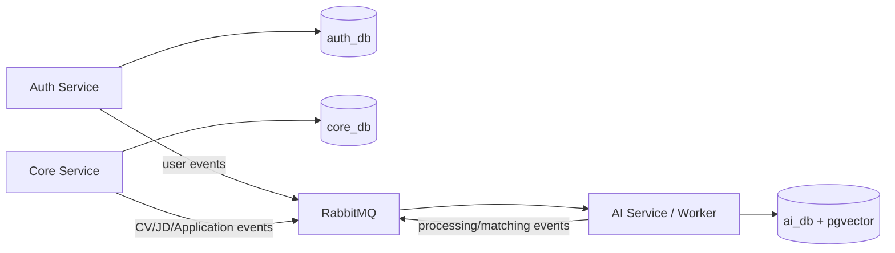
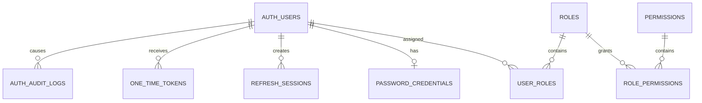
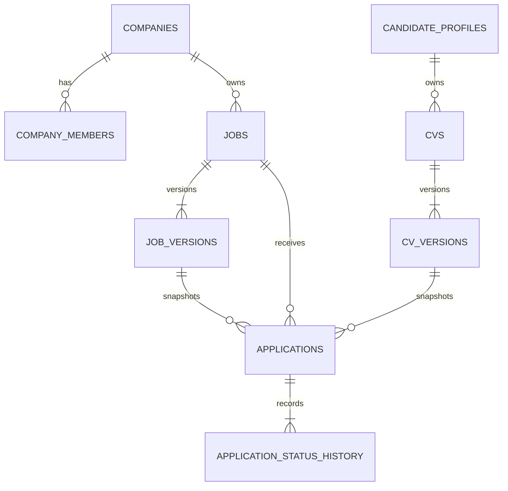

# Thiết kế cơ sở dữ liệu vật lý

| Thuộc tính | Giá trị |
|---|---|
| Mã tài liệu | DOC-DB-001 |
| Phiên bản | 0.2.0 |
| Ngày cập nhật | 2026-07-20 |
| Trạng thái | Working baseline |
| Phạm vi | Auth Service, Core Service, AI Service/Worker |

## 1. Quyết định kiến trúc database

Hệ thống sử dụng **PostgreSQL 16** làm hệ quản trị cơ sở dữ liệu chính. Trong môi trường đồ án, ba service dùng chung một PostgreSQL server/container để tiết kiệm tài nguyên nhưng mỗi service sở hữu một logical database và tài khoản kết nối riêng.

```text
PostgreSQL server/container
├── auth_db  → Auth Service
├── core_db  → Core Service
└── ai_db    → AI Service/Worker + pgvector
```

Các nguyên tắc bắt buộc:

1. Service chỉ được đọc/ghi database do mình sở hữu.
2. Không join, foreign key hoặc transaction xuyên database.
3. ID của entity thuộc service khác chỉ được lưu dưới dạng opaque UUID.
4. Service trao đổi dữ liệu qua API hoặc RabbitMQ event.
5. `pgvector` chỉ được cài trong `ai_db`.
6. File CV PDF/DOCX được lưu trong private object storage; database chỉ lưu metadata và `object_key`.
7. RabbitMQ là message broker, không phải nơi lưu trạng thái nghiệp vụ cuối cùng.
8. Khi cần scale, từng logical database có thể chuyển sang PostgreSQL instance riêng mà không thay đổi ownership hoặc contract.



## 2. Quy ước chung

- Tên bảng và cột dùng `snake_case`.
- ID nghiệp vụ dùng UUID; không dùng sequence nội bộ làm global identity.
- Thời gian dùng `timestamptz` và lưu theo UTC.
- Tiền dùng `numeric`, không dùng floating point.
- Điểm và confidence dùng `numeric` với constraint miền giá trị.
- Trạng thái dùng `varchar` kèm check constraint hoặc bảng tham chiếu; tránh phụ thuộc PostgreSQL enum khi trạng thái còn có thể thay đổi.
- Bảng mutable có `created_at`, `updated_at` và `version` phục vụ optimistic locking.
- Bản ghi version, history, audit, matching result và experiment là append-only hoặc immutable theo chính sách.
- `jsonb` chỉ dùng cho payload linh hoạt, config hoặc metadata; dữ liệu cần ràng buộc và truy vấn nghiệp vụ phải được mô hình hóa thành cột/bảng quan hệ.
- Không ghi password, access token, refresh token, OTP hoặc secret dạng plaintext.
- Không đưa raw PII vào event, embedding, prompt log hoặc bảng nghiên cứu.

## 3. `auth_db`

### 3.1 Trách nhiệm

`auth_db` quản lý danh tính, đăng ký, đăng nhập, JWT/refresh session và quyền cấp hệ thống. Database này không chứa Company, CV, Job, Application, taxonomy hoặc matching result.



### 3.2 Danh mục bảng

| Bảng | Trường cốt lõi | Mục đích và ràng buộc chính |
|---|---|---|
| `auth_users` | `id`, `email`, `normalized_email`, `status`, `email_verified_at`, `last_login_at`, timestamps, `version` | `normalized_email` unique; trạng thái `PENDING`, `ACTIVE`, `SUSPENDED`, `DELETED` |
| `password_credentials` | `user_id`, `password_hash`, `hash_algorithm`, `password_changed_at`, `failed_attempt_count`, `locked_until`, `updated_at` | Một credential local cho một user; chỉ lưu Argon2id/BCrypt hash |
| `roles` | `id`, `code`, `name`, `status` | `code` unique; seed `CANDIDATE`, `RECRUITER`, `SYSTEM_ADMIN` |
| `permissions` | `id`, `code`, `description` | `code` unique; quyền cấp hệ thống |
| `user_roles` | `user_id`, `role_id`, `assigned_at`, `assigned_by` | PK/unique `(user_id, role_id)` |
| `role_permissions` | `role_id`, `permission_id` | PK/unique `(role_id, permission_id)` |
| `refresh_sessions` | `id`, `user_id`, `token_hash`, `token_family_id`, `expires_at`, `revoked_at`, `revoke_reason`, `created_at` | `token_hash` unique; hỗ trợ rotation và phát hiện reuse |
| `one_time_tokens` | `id`, `user_id`, `token_type`, `token_hash`, `expires_at`, `consumed_at`, `created_at` | Dùng cho verify email/reset password; chỉ lưu token hash |
| `auth_audit_logs` | `id`, `actor_user_id`, `action`, `target_user_id`, `outcome`, `correlation_id`, `metadata`, `occurred_at` | Append-only; metadata không chứa secret |
| `outbox_events` | `id`, `aggregate_type`, `aggregate_id`, `event_type`, `schema_version`, `payload`, `occurred_at`, `published_at`, `attempt_count` | Phát event đáng tin cậy sau transaction |

### 3.3 Ranh giới phân quyền

Auth chỉ xác nhận một tài khoản có global role `RECRUITER`. Quyền sửa Job hoặc xem Application của một Company phải được Core kiểm tra qua `company_members`. Không đưa toàn bộ danh sách Company/permission động vào JWT dài hạn.

### 3.4 Index tối thiểu

- Unique index `auth_users(normalized_email)`.
- Unique `user_roles(user_id, role_id)`.
- Unique `refresh_sessions(token_hash)`.
- Index `refresh_sessions(user_id, revoked_at, expires_at)`.
- Index `one_time_tokens(user_id, token_type, expires_at)`.
- Index `auth_audit_logs(actor_user_id, occurred_at)`.
- Index `outbox_events(published_at, occurred_at)` cho event chưa phát.

## 4. `core_db`

### 4.1 Trách nhiệm

`core_db` sở hữu nghiệp vụ tuyển dụng: Company, membership, hồ sơ hiển thị, metadata/version CV, Job/JD gốc, Application, consent và lịch sử trạng thái. Raw file CV nằm trong object storage, không nằm trong PostgreSQL.



### 4.2 Hồ sơ và Company

| Bảng | Trường cốt lõi | Mục đích và ràng buộc chính |
|---|---|---|
| `candidate_profiles` | `user_id`, `display_name`, `headline`, `location`, `visibility`, `consent_version`, timestamps, `version` | `user_id` là opaque Auth ID; protected fields không đi vào matching |
| `recruiter_profiles` | `user_id`, `display_name`, `business_contact`, timestamps, `version` | Hồ sơ Recruiter; quyền thực tế lấy từ membership |
| `companies` | `id`, `name`, `slug`, `description`, `website`, `size_range`, `status`, `created_by_user_id`, timestamps, `version` | `slug` unique; trạng thái `PENDING`, `ACTIVE`, `SUSPENDED` |
| `company_members` | `id`, `company_id`, `user_id`, `role`, `status`, `joined_at`, `created_at` | Unique `(company_id, user_id)`; role `OWNER`, `COMPANY_ADMIN`, `RECRUITER`, `VIEWER` |

`user_id` và `created_by_user_id` không có foreign key tới `auth_db`. Core có thể kiểm tra sự tồn tại của user qua event projection hoặc Auth API khi cần.

### 4.3 CV và consent

| Bảng | Trường cốt lõi | Mục đích và ràng buộc chính |
|---|---|---|
| `cvs` | `id`, `candidate_user_id`, `title`, `active_version_id`, `status`, timestamps, `version` | Container logic của CV; không chứa raw file |
| `cv_versions` | `id`, `cv_id`, `version_number`, `object_key`, `original_filename`, `mime_type`, `size_bytes`, `sha256`, `language_hint`, `processing_status`, `created_at` | Source immutable; unique `(cv_id, version_number)` |
| `candidate_consents` | `id`, `candidate_user_id`, `consent_type`, `consent_version`, `accepted_at`, `revoked_at`, `metadata` | Ghi nhận quyền xử lý/chia sẻ CV theo phiên bản chính sách |

Trạng thái `cv_versions.processing_status` baseline:

```text
UPLOADED → QUEUED → PROCESSING → PARSED → NEEDS_REVIEW → CONFIRMED
    └────→ REJECTED                └──────→ FAILED
```

REJECTED dùng cho file không qua validation đầu vào; FAILED dùng cho lỗi terminal trong extract/parse. Cả hai phải có mã lỗi an toàn và không được nằm lại ở QUEUED/PROCESSING. Khi Candidate thay CV, hệ thống tạo `cv_versions` mới. Phiên bản đã được Application hoặc MatchingResult sử dụng không bị ghi đè.

### 4.4 Job và phiên bản JD

| Bảng | Trường cốt lõi | Mục đích và ràng buộc chính |
|---|---|---|
| `jobs` | `id`, `company_id`, `created_by_user_id`, `active_version_id`, `status`, `published_at`, `closed_at`, timestamps, `version` | Lifecycle DRAFT, PUBLISHED, CLOSED; Closed không reopen |
| `job_versions` | `id`, `job_id`, `version_number`, `title`, `description`, `requirements_text`, `location`, `work_mode`, `employment_type`, `level`, salary fields, `source_hash`, `created_by_user_id`, `created_at` | Snapshot JD immutable; unique `(job_id, version_number)` |

Các trường Core quản lý trực tiếp:

- Tiêu đề và nội dung JD gốc.
- Company, địa điểm, chế độ làm việc và loại hợp đồng.
- Cấp bậc, lương, trạng thái publish/close.

Kỹ năng `required/preferred`, evidence và confidence do AI phân tích được lưu trong `ai_db`; Recruiter confirmation được AI lưu kèm parsed revision.

### 4.5 Application

| Bảng | Trường cốt lõi | Mục đích và ràng buộc chính |
|---|---|---|
| `applications` | `id`, `candidate_user_id`, `job_id`, `cv_version_id`, `job_version_id`, `status`, `latest_matching_result_id`, `matching_status`, `applied_at`, timestamps, `version` | Snapshot đúng CV/JD version tại thời điểm apply |
| `application_status_history` | `id`, `application_id`, `from_status`, `to_status`, `actor_user_id`, `reason`, `occurred_at`, `correlation_id` | Append-only; mọi transition quan trọng có actor/reason |

Trạng thái Application baseline:

```text
SUBMITTED
UNDER_REVIEW
SHORTLISTED
REJECTED
WITHDRAWN
```

`latest_matching_result_id` là opaque AI ID, không có foreign key sang `ai_db`. Matching chỉ hỗ trợ sàng lọc; hệ thống không tự đổi Application sang `REJECTED` dựa trên score.

Unique policy baseline là duy nhất một Application trên (candidate_user_id, job_id) trong toàn vòng đời. REJECTED và WITHDRAWN là terminal; không re-apply trong MVP.

### 4.6 Tích hợp và audit

| Bảng | Mục đích |
|---|---|
| `outbox_events` | Ghi event trong cùng transaction với thay đổi Core |
| `inbox_messages` | Chống xử lý trùng event nhận từ service khác |
| `core_audit_logs` | Audit Company membership, Job, CV access và Application status |

### 4.7 Index tối thiểu

- Unique `companies(slug)`.
- Unique `company_members(company_id, user_id)`.
- Unique `cv_versions(cv_id, version_number)`.
- Unique `job_versions(job_id, version_number)`.
- Unique `applications(candidate_user_id, job_id)` cho toàn vòng đời.
- Index `jobs(company_id, status, published_at)`.
- Index `applications(job_id, status, applied_at)`.
- Index `applications(candidate_user_id, applied_at)`.
- Index `cv_versions(sha256)` phục vụ deduplicate theo policy.
- Index `outbox_events(published_at, occurred_at)`.

## 5. `ai_db`

### 5.1 Trách nhiệm

`ai_db` sở hữu kết quả parsing, normalized entities, evidence, taxonomy, PendingSkill, embedding, phiên bản model/thuật toán, processing task, matching result và metadata thực nghiệm. Database này không chứa credential, Company business data hoặc raw PII không cần thiết.

### 5.2 Parsed CV/JD và evidence

| Bảng | Trường cốt lõi | Mục đích và ràng buộc chính |
|---|---|---|
| `parsed_cvs` | `id`, `cv_version_id`, `revision`, `schema_version`, `parser_version`, `language`, `payload`, `status`, `overall_confidence`, `confirmed_by_user_id`, `created_at` | Unique `(cv_version_id, revision)`; revision immutable |
| `parsed_jds` | `id`, `job_version_id`, `revision`, `schema_version`, `parser_version`, `language`, `payload`, `status`, `overall_confidence`, `confirmed_by_user_id`, `created_at` | Unique `(job_version_id, revision)`; revision immutable |
| `parsed_cv_skills` | `id`, `parsed_cv_id`, `raw_term`, `skill_id`, `taxonomy_version_id`, `proficiency_level`, `experience_months`, `normalization_status`, `confidence`, `evidence_id` | `skill_id` nullable khi pending/unresolved |
| `parsed_jd_skills` | `id`, `parsed_jd_id`, `raw_term`, `skill_id`, `taxonomy_version_id`, `requirement_type`, `criticality`, `minimum_months`, `confidence`, `confirmed_by_recruiter`, `evidence_id` | Phân biệt `REQUIRED`/`PREFERRED` |
| `evidences` | `id`, source/parsed reference, `field_path`, offsets, `redacted_text`, `text_hash`, `page_number`, `provenance`, `confidence`, `created_at` | Phải trỏ đúng một ParsedCV hoặc ParsedJD |

`cv_version_id` và `job_version_id` là opaque Core IDs. AI không tạo foreign key sang `core_db`.

`payload jsonb` giữ hợp đồng ParsedCV/ParsedJD đầy đủ; các skill cần join/match được chiếu sang bảng quan hệ riêng. PII như name, email, phone, address và photo không được đặt trong payload dùng cho matching.

### 5.3 Taxonomy và PendingSkill

| Bảng | Trường cốt lõi | Mục đích và ràng buộc chính |
|---|---|---|
| `taxonomy_versions` | `id`, `semantic_version`, `parent_version_id`, `status`, `change_summary`, `published_by_user_id`, `published_at`, `created_at` | Published version immutable |
| `skills` | `id`, `created_at`, `retired_at` | Stable identity của skill qua nhiều taxonomy version |
| `skill_definitions` | `id`, `skill_id`, `taxonomy_version_id`, `canonical_name`, `normalized_name`, `category`, `description`, `status` | Unique theo version và canonical name |
| `skill_aliases` | `id`, `skill_id`, `taxonomy_version_id`, `alias`, `normalized_alias`, `language` | Alias có version, ví dụ `JS → JavaScript` |
| `pending_skills` | `id`, `fingerprint`, raw/normalized term, `status`, `llm_suggestion`, `proposal_model_id`, `occurrence_count`, resolution/decision fields, timestamps | LLM chỉ tạo proposal; Admin mới được thay taxonomy |
| `pending_skill_occurrences` | `id`, `pending_skill_id`, `source_type`, `source_ref_id`, `evidence_id`, `context_hash`, `created_at` | Gộp nhiều occurrence của cùng fingerprint |

Trạng thái PendingSkill:

```text
PENDING_REVIEW
DEFERRED
APPROVED
EDITED_AND_APPROVED
MERGED
REJECTED
```

Approve/Edit/Merge tạo `taxonomy_versions` mới; không sửa published version đã được MatchingResult hoặc ExperimentRun sử dụng.

### 5.4 Model, algorithm và embedding

| Bảng | Trường cốt lõi | Mục đích và ràng buộc chính |
|---|---|---|
| `model_versions` | `id`, `provider`, `model_name`, `revision`, `model_type`, `dimension`, `config_hash`, `created_at` | Không chỉ lưu tên model mơ hồ |
| `algorithm_versions` | `id`, `name`, `config`, `config_hash`, `code_ref`, `created_at` | Config/code reference immutable |
| `embeddings` | `id`, `subject_type`, `subject_id`, `model_version_id`, `content_hash`, `dimension`, `embedding`, `created_at` | Unique theo subject/model/content |

`subject_type` baseline:

```text
CV
JD
SKILL
```

Kích thước vector chỉ được freeze sau khi chốt embedding model. Với nhiều model có dimension khác nhau, cần tách bảng/index hoặc dùng policy theo model. HNSW/IVFFlat index chỉ được tạo sau khi đo dataset size, query plan, recall và latency; không chọn index theo xu hướng.

### 5.5 Matching và explanation

| Bảng | Trường cốt lõi | Mục đích và ràng buộc chính |
|---|---|---|
| `matching_results` | `application_id` nullable cho offline experiment, `experiment_run_id` nullable, input/version tuple, score fields, `status`, `confidence`, `flags`, `explanation`, `supersedes_result_id`, `created_at` | Product result bắt buộc application_id; offline result bắt buộc experiment_run_id; immutable/idempotent |
| `matching_components` | `matching_result_id`, `component_type`, score, weight, contribution, confidence, `details` | Giải thích điểm theo tiêu chí |
| `matching_component_evidences` | `matching_component_id`, `evidence_id`, `relation_type` | Nối điểm thành phần với bằng chứng |

Logical unique key của `matching_results`:

```text
(cv_version_id,
 job_version_id,
 parsed_cv_revision,
 parsed_jd_revision,
 taxonomy_version_id,
 algorithm_version_id,
 embedding_model_version_id)
```

Thành phần điểm baseline:

```text
REQUIRED_SKILL
PREFERRED_SKILL
EXPERIENCE
EDUCATION
LANGUAGE
SEMANTIC_SIMILARITY
```

Score không tự quyết định tuyển/loại và không tự thay Application status.

### 5.6 Xử lý bất đồng bộ

| Bảng | Trường cốt lõi | Mục đích và ràng buộc chính |
|---|---|---|
| `processing_tasks` | `id`, `task_type`, `subject_type`, `subject_id`, `state`, attempts, `idempotency_key`, retry/error/correlation fields, timestamps | Durable task state; `idempotency_key` unique |
| `inbox_messages` | `message_id`, `event_type`, `received_at`, `processed_at`, `result`, `error_code` | Chống xử lý message trùng |
| `outbox_events` | Event envelope, payload ref, publish state | Phát trạng thái/kết quả về Core |

Trạng thái task baseline:

```text
PENDING
PROCESSING
RETRYING
COMPLETED
NEEDS_REVIEW
FAILED
DEAD_LETTER
CANCELLED
```

RabbitMQ chỉ vận chuyển message. `processing_tasks`, inbox/outbox và kết quả bền vững trong PostgreSQL giúp retry/idempotency an toàn.

### 5.7 Schema nghiên cứu trong `ai_db`

Để phục vụ đánh giá đồ án mà không tạo service/database thứ tư, `ai_db` có thể chứa schema logic `research` do AI service/evaluation runner sở hữu:

| Bảng | Mục đích |
|---|---|
| `research.datasets` | Phiên bản, scope, license/consent và split policy |
| `research.dataset_items` | Pseudonymous document reference và split/group key |
| `research.evaluation_pairs` | Cặp CV–JD cần đánh giá |
| `research.annotations` | Nhãn, rubric version, annotator pseudonym, confidence |
| `research.experiment_runs` | Dataset/model/taxonomy/algorithm/code version, seed, environment |
| `research.experiment_metrics` | Precision, Recall, F1, MRR, NDCG và metric thành phần |

Research schema chỉ chứa dữ liệu đã ẩn danh/pseudonymized và không thay thế database nghiệp vụ.

### 5.8 Index tối thiểu

- Unique `parsed_cvs(cv_version_id, revision)`.
- Unique `parsed_jds(job_version_id, revision)`.
- Unique `skill_definitions(taxonomy_version_id, normalized_name)`.
- Index `skill_aliases(taxonomy_version_id, normalized_alias)`.
- Index `pending_skills(status, fingerprint, occurrence_count)`.
- Unique `processing_tasks(idempotency_key)`.
- Index `processing_tasks(state, next_retry_at)`.
- Unique matching version tuple.
- Index `matching_results(job_version_id, final_score)` cho ranking ứng viên.
- Vector index được bổ sung sau benchmark, không mặc định ngay từ đầu.

## 6. Ánh xạ ID giữa các database

| ID | Nơi tạo/sở hữu | Nơi được tham chiếu |
|---|---|---|
| `user_id` | `auth_db.auth_users` | Profile, CompanyMember, CV, Application, Admin decision |
| `company_id` | `core_db.companies` | Chỉ trong Core; AI không cần Company data nếu không phục vụ matching |
| `cv_version_id` | `core_db.cv_versions` | ParsedCV, embedding, task, matching trong AI |
| `job_version_id` | `core_db.job_versions` | ParsedJD, embedding, task, matching trong AI |
| `matching_result_id` | `ai_db.matching_results` | Opaque reference/projection trong Core Application |
| `taxonomy_version_id` | `ai_db.taxonomy_versions` | Parsed skills, matching result, experiment |

Không có foreign key xuyên database. Tính nhất quán được bảo đảm bằng event contract, idempotency, version snapshot và reconciliation job khi cần.

## 7. Event tối thiểu liên quan database

| Event | Producer | Consumer | Payload tối thiểu |
|---|---|---|---|
| `user.created.v1` | Auth | Core | `userId`, global roles, occurredAt |
| `cv.uploaded.v1` | Core | AI | `cvVersionId`, private object reference, source hash |
| `job.version.ready.v1` | Core | AI | `jobVersionId`, authorized content reference/hash |
| `application.submitted.v1` | Core | AI | `applicationId`, `cvVersionId`, `jobVersionId` |
| `document.processed.v1` | AI | Core | source version ID, revision, status, quality flags |
| `matching.completed.v1` | AI | Core | input IDs, `matchingResultId`, status, final score/ref |
| `taxonomy.published.v1` | AI/Admin | AI workers | taxonomy version ID, change-set reference |

Mọi event có `event_id`, `correlation_id`, `idempotency_key`, `schema_version`, `occurred_at` và object/reference thay vì raw CV.

## 8. Migration và triển khai

- Auth/Core dùng migration riêng của service, dự kiến Flyway nếu triển khai bằng Spring Boot.
- AI dùng Alembic nếu triển khai bằng Python/FastAPI.
- Mỗi service có database user riêng: `auth_app`, `core_app`, `ai_app`.
- Database user không được cấp quyền trên database khác.
- Migration chạy forward-only; migration destructive cần backup và xác nhận riêng.
- Seed chỉ chứa role/permission/taxonomy mẫu không nhạy cảm.
- Backup database và object storage metadata phải được thử restore trước buổi bảo vệ.

## 9. Những nội dung chưa freeze

Các mục sau cần tiếp tục chốt trước khi viết migration/DDL chính thức:

1. Retention và xóa/anonymize CV, Application snapshot, audit, prompt/response.
2. Embedding model và vector dimension.
3. Trường profile/contact nào thực sự cần lưu để giảm PII.
4. Chính sách Company verification và invitation.

## 10. Baseline được đề xuất để triển khai

```text
PostgreSQL 16
├── auth_db: identity, credential, session, global RBAC
├── core_db: company, profile, CV metadata/version, job/version, application
└── ai_db: parsed data, evidence, taxonomy, pgvector, matching, research

MinIO/local private object storage: raw CV files
RabbitMQ: asynchronous commands/events
```

Thiết kế này giữ hệ thống đủ gọn để chạy bằng Docker Compose trên máy cá nhân, đồng thời bảo toàn ranh giới dữ liệu để tách từng database sang instance riêng khi cần scale.
